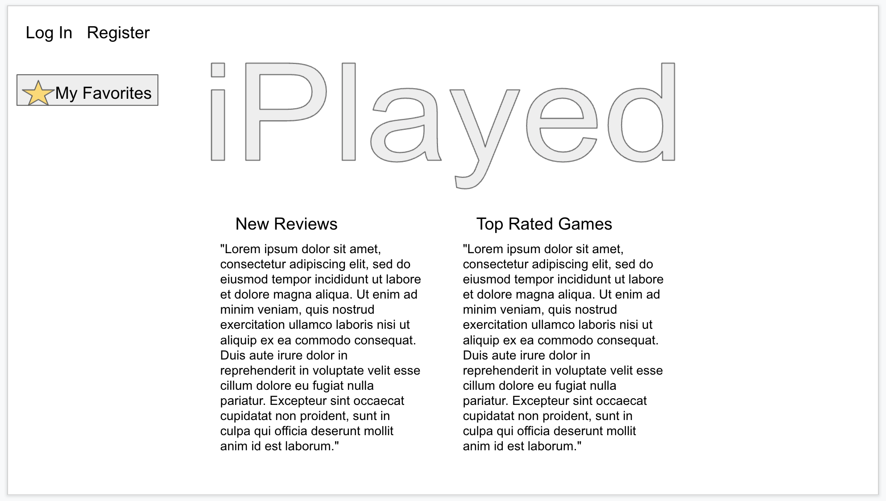
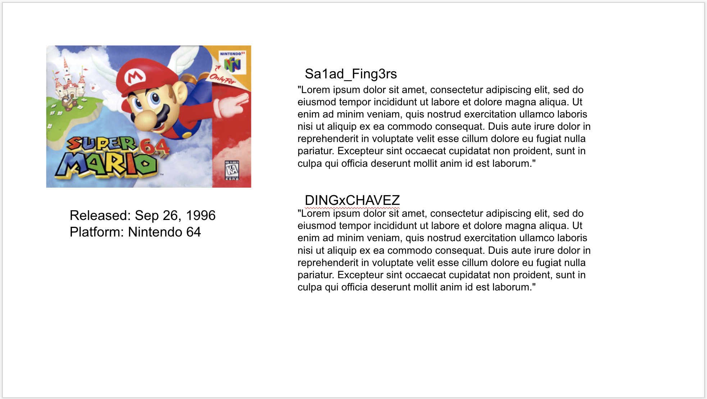

# iPlayed: game reviews

https://iplayed-game-reviews.herokuapp.com/

## What is it?

iPlayed was inspired by the beer-rating social app, Untappd, as a way to share reviews of games that you have played with your friends.

## Start Up Screen:

# HOW TO USE

1. Visit https://iplayed-game-reviews.herokuapp.com/
2. Create a user account
3. Click on the links in the navigation bar to add a new game or see a list of current titles.

### User Model

| Column Name | Data Type | Notes |
| --------------- | ------------- | ------------------------------ |
| id | Integer | Serial Primary Key, Auto-generated |
| first_name | String | Must be provided |
| last_name | String | Must be provided |
| email | String | Must be unique / used for login |
| password | String | Stored as a hash |
| createdAt | Date | Auto-generated |
| updatedAt | Date | Auto-generated |

### Game Model

| Column Name | Data Type | Notes |
| --------------- | ------------- | ------------------------------ |
| name | String | Must be provided |
| first_release_date | String | Must be provided |
| platforms | String | Must be unique / used for login |
| createdAt | Date | Auto-generated |
| updatedAt | Date | Auto-generated |

# FUTURE CONSIDERATIONS

Stretch goals for this project include:

 * Adding review functionality. Currently users can create games, but reviews have not yet been implemented.

 * Linking an API from IGN.com to auto-populated game data.

# PROCESS WORK

## Initial Wireframes:

### Home Screen

### Game Review

