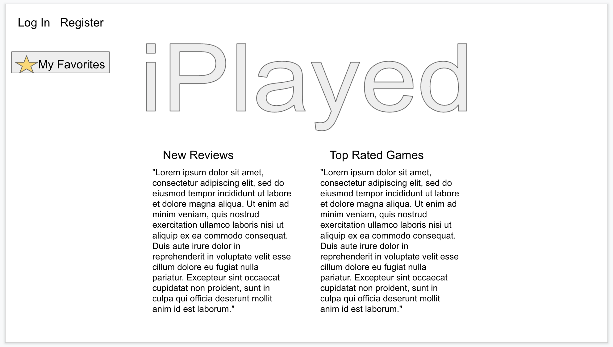
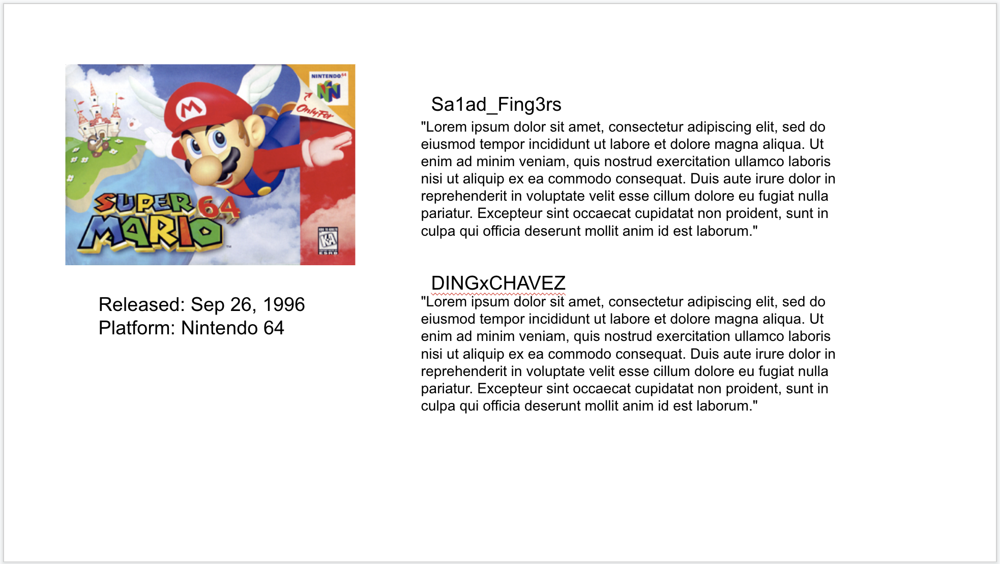
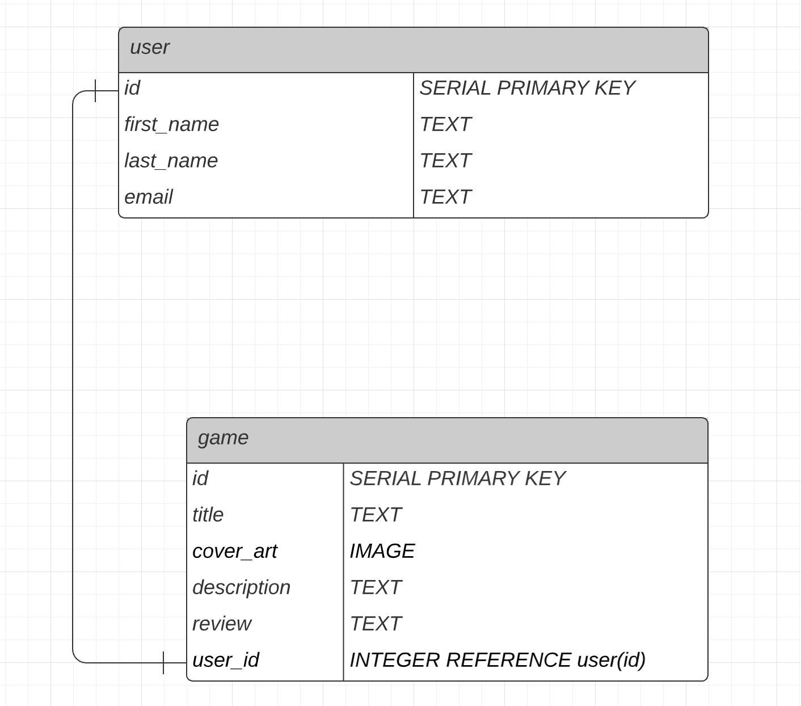

# Proposal
Requirements for the weekend

`1` An application name / concept
The app is called iPlayed. Users can create an account, log in, and post or read game reviews. The user can search a title and the website will generate the cover art, release year, platform information and other reviews. 

`2` A repo for your project 2 (built from express_auth template)
https://github.com/jakeschultz89/iPlayed

`3` Wireframe for your app - (Lucidchart)

## Home Screen

## Game Review

`4` An ERD with two models (minimum) > User + 1 Resource (one to many) - (Lucidchart)

`5` Create (3-5) User Stories for the base user experience - ( [Reference](https://revelry.co/resources/development/user-stories-that-dont-suck/) )

1 - As a user I want to be able to log in and review games that I've played.

2 - As a user I want to be able to see reviews posted by friends and other users.

3 - As a user I want to see additional informatio for the games I am reviewing (cover art, platform and year released.)

`6` Resource's Restful Routing table ( [Readme](https://romebell.gitbook.io/sei-412/node-express/00readme-1/01intro-to-express/00readme#restful-routing) )

`7` Find API and test to see if you can get data ( *be able to print data in the console using Axios, Node-Fetch, and/or Postman* )